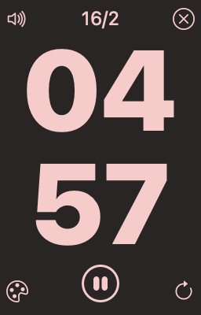

# Pomodoro
A simple pomodoro timer write in Wails and Svelte.

[Click to Download](https://github.com/andycai/pomodoro/releases)

- [macOs](https://github.com/andycai/pomodoro-tauri-react/releases/download/v0.7.1/pomodoro_0.7.1_x64.dmg)
- [Windows](https://github.com/andycai/pomodoro-tauri-react/releases/download/v0.7.1/pomodoro_0.7.1_x64-setup.exe)
- [Linux](https://github.com/andycai/pomodoro-tauri-react/releases/download/v0.7.1/pomodoro_0.7.1_amd64.deb)

## Screenshots




# Wails + Svelte + Typescript

This template should help get you started developing with Wails, Svelte and Typescript in Vite.

## Recommended IDE Setup

- [VS Code](https://code.visualstudio.com/) 

## Install Wails support

Wails has a number of common dependencies that are required before installation:

- Go 1.18+
- NPM (Node 15+)

```bash
go install github.com/wailsapp/wails/v2/cmd/wails@latest
```

## Run project

```bash
wails dev
```

## Build project

```bash
wails build 
`````